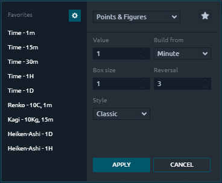
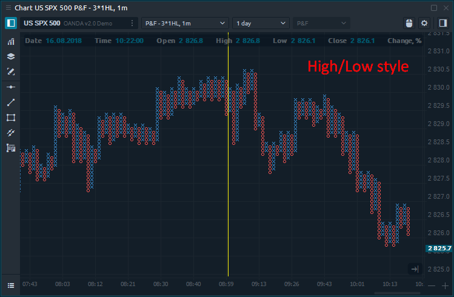

# Points & Figures

### General info

Points & Figures is one of the most popular chart types that allows traders to analyze only the price without time-bound, thereby eliminating market noise. In contrast to the usual candlestick charts, P & F consists of X and O columns, which reflect the rise or fall in prices, respectively. 

P&F charts provide a unique look at price action that has several advantages:

* Filter insignificant price movements and noise
* Focus on important price movements
* Determine support and resistance levels
* Identify trends and reversal points
* Remove the time aspect from the analysis process

### How is the Point & Figure chart built?

The plotting of P & F chart depends on several basic parameters:

* **Box size**, which determines the price range \(the number of ticks\) for X-Columns or O-Columns. Each X and O occupies an area called _**Box**_, the size of which is determined by the Box Size parameter. No Xs or Os are displayed if prices rise or fall by an amount that is less than the box size.
* **Reversal**, a parameter that indicates the number of Box Sizes that the price should go in the opposite direction to begin a new column. A new column, therefore, signals a change in the price trend.
* **Build from** parameter specifies the time frame of the data that is used to build the Point and Figure bars.

To build a chart, you can use two styles: 

* **Classic**, which uses only the closing price \(last price\) to plot the chart. 
* **High / Low** is based on High and Low prices.

