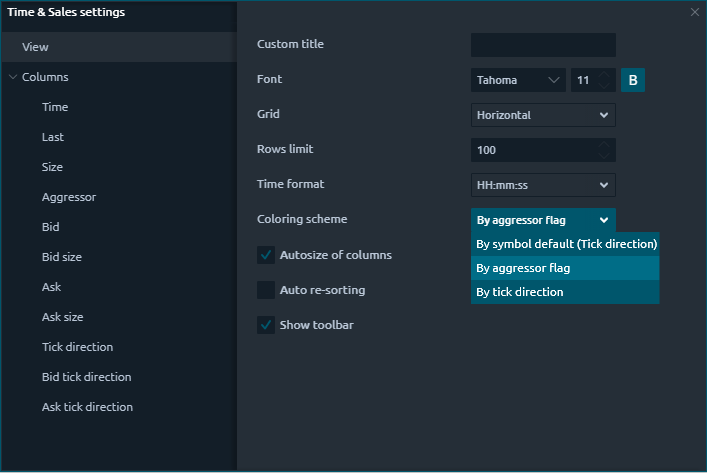

# Time & Sales

### What is Time and Sales

**Time & Sales** panel displays all trades that occur for selected instrument and provides details for each trade including date, time, price, and quantity. Each line is color-coded to indicate whether the trade was a result of an aggressive buyer or seller.

Time & Sales panel keeps a running record of trades for selected instruments displayed in chronological order. Each new entry is added to the top of the list, causing the panel screen to auto-scroll downward.

### General settings

The basic settings in Time & Sales are similar to the parameters of most panels in Quantower — full flexibility in color settings, fonts, columns visibility, data position relative to the column, etc. 

But some settings are unique for this panel:

* **Rows limit** — this is the number of lines that will be displayed in the table, to save the memory of your computer. When the number of lines exceeds the specified value, the old values will be deleted as new ones appear
* **Time format** — allows setting the accuracy of time for executed trades.
* **Coloring scheme** — this option sets the color scheme for all rows of the table, depending on the selected condition:  
  If you chose **“By Aggressor Flag”**, then for the trades with the Buy direction the line will be blue, and for the Sell trades, the line will be red. If the Aggressor flag is not defined \(None\) then the color lime will be white.

  If you selected **“By Tick Direction”**, then the lines will be colored according to the change in the last price.

### Export Data

Time & Sales panel allows exporting executed trades to _CSV_ or _HTML_ files for further analysis. Soon we will add the ability to auto-update the data directly in the external file via DDE and RTD functions.

* Select the "**Export Data**" in the panel's menu
* Select the necessary data that you want to export and click on the **\[Export File\]** button
* Specify the type of files and the path to save it

### Setup Actions - Filters & Actions

We wrote about this functionality in the Advanced table filters and actions section, which explains in details the process of adding filters and creating different notifications. But if you have additional questions or proposals about this functional, feel free to contact us. We are here to help you!

