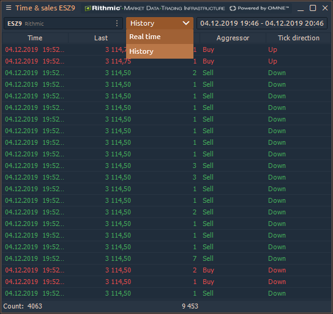

# Time & Sales

### What is Time and Sales

**Time & Sales** panel displays all trades that occur for selected instrument and provides details for each trade including date, time, price, and quantity. Each line is color-coded to indicate whether the trade was a result of an aggressive buyer or seller.

Time & Sales panel keeps a running record of trades for selected instruments displayed in chronological order. Each new entry is added to the top of the list, causing the panel screen to auto-scroll downward.


Aggregated Time & Sales in Quantower also known as Reconstructed Tape


### Real-time and Historical modes

Real-time mode shows all the trades that are currently executed. The historical mode allows you to get all past trades for a specified period of time directly in the panel.

### General settings

The basic settings in Time & Sales are similar to the parameters of most panels in Quantower — full flexibility in color settings, fonts, columns visibility, data position relative to the column, etc.&#x20;

But some settings are unique for this panel:

* **Rows limit** — this is the number of lines that will be displayed in the table, to save the memory of your computer. When the number of lines exceeds the specified value, the old values will be deleted as new ones appear
* **Time format** — allows setting the time accuracy for executed trades.
*   **Coloring scheme** — this option sets the color scheme for all rows of the table, depending on the selected condition:\
    If you chose **“By Aggressor Flag”**, then for the trades with the Buy direction the line will be blue, and for the Sell trades, the line will be red. If the Aggressor flag is not defined (None) then the color lime will be white.

    If you selected **“By Tick Direction”**, then the lines will be colored according to the change in the last price.
* **Aggregate Trades** — this mode allows tracking large traders, by summing up trades that match in price, direction and time
* **Time Delay, ms** — it will continue to sum up the data within the specified time, with the same price and trade direction.

### Export Data

Time & Sales panel allows exporting executed trades to _CSV_ or _HTML_ files for further analysis. Soon we will add the ability to auto-update the data directly in the external file via DDE and RTD functions.

<figure><figcaption>
T &#x26; S panel allows exporting data into external files
</figcaption></figure>

* Select the "**Export Data**" in the panel's menu
* Select the necessary data that you want to export and click on the **\[Export File]** button
* Specify the type of files and the path to save it

### Setup Actions - Filters & Actions

We wrote about this functionality in the [**Advanced table filters and actions**](https://help.quantower.com/getting-started/table-management#advanced-table-filter) section, which explains in details the process of adding filters and creating different notifications. Here we briefly describe the filtering process in the table and the settings of various actions.

#### Filtering in the Time & Sales table

Rows in the table can be filtered by some data value in their column. There are two ways to apply the filtering:

* **Quick filtering** can be accessed by clicking the “_**Filter**_” icon in any table column’s header.

Once you select some option — the table rows will be filtered to those ones, containing the selected value. Quick filter can be canceled by pressing “_**Cancel filtering**_” option.


Quick filtering can be applied only to one column of the table. For filtering multiple columns, we recommend to use  “_**Setup actions**_”.


* **Advanced filtering,** for applying more complex filtering (multi-filtering). Select in the panel's context menu option “_**Setup actions**_”.&#x20;

<figure><figcaption></figcaption></figure>

This screen has two tabs on the left side, where the first one is an Advanced filter.

This screen allows you to Enable/Disable filtering as well as set up filtering Conditions. These conditions are set up as:

&#x20;                                               _IF (condition1 AND condition2 ...) OR (conditionN...) …_

You can set up as many conditions as you like. Due to the possible complex logic of filtering, you are required to apply the changes once you finished the filter set up.

If you have additional questions or proposals about this functional, feel free to contact us. We are here to help you!
