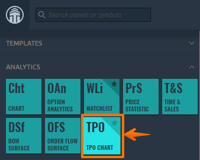

# TPO Profile Chart

**Time Price Opportunity** or **TPO Chart**, shows the price distribution during the specified time, thus forming a profile. This allows you to understand at which levels or ranges the price has spent the most time, as well as to determine the main support and resistance levels.

To open new TPO panel, go to _**Main menu**_ \(Logo icon\) and select _**TPO Chart**_ in the Analytics section.

### Key Elements of TPO Profile Chart

**Point of Control \(POC\)** — price level of the greatest market activity or trading volume. At this level, the price spent most time over the profile range.

**Value Area** — price range in which approximately 68% - 70% of the market activity or trading volume took place.

**Singles** or **single prints** of the profile are placed in the middle of a profile structure, not at the upper or lower edge. They occur on impulse movements and are used as support/resistance zones, which the price can test in the near future. The singles line indicates where the singles begin to form \(in cases when there are several single prints\).

**TPO letters** — basic element of the TPO chart, where each letter corresponds to a specific time \("**Build From**"\).

