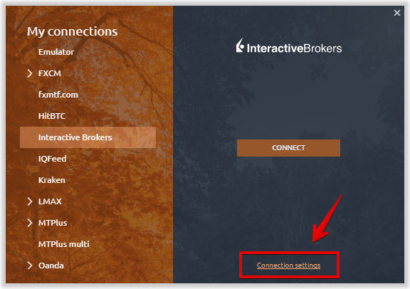
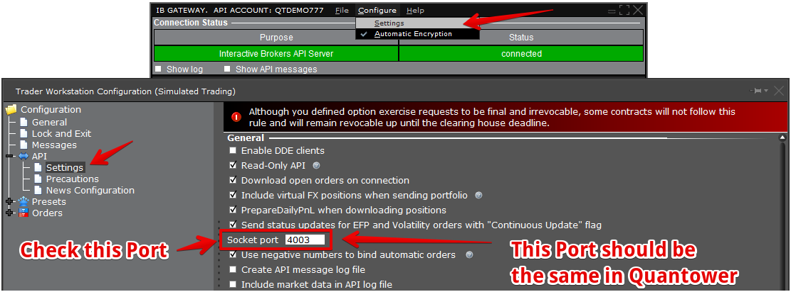

# Connection to Interactive Brokers

* ****[**Data Limitations**](./#data-limitations)****
* ****[**Necessary steps for successful connection to Quantower**](./#necessary-steps-for-successful-connection-to-quantower)****
* ****[**How to connect to Interactive Brokers using TWS platform**](./#how-to-connect-to-interactive-brokers-using-tws-platform)****
* ****[**How to connect to Interactive Brokers using IB Gateway**](./#how-to-connect-to-interactive-brokers-using-ib-gateway)****
* ****[**Problems during the connection to Interactive Brokers**](./#problems-during-the-connection-to-interactive-brokers)****
* ****[**How to subscribe to IB market data**](./#how-to-subscribe-to-ib-market-data)****

## Data Limitations

Interactive Brokers places the following limitations on real-time and historical data accessible to 3rd party applications

* **Pacing Violations** – TWS limits the number of requests for data. If too many requests for data occur in a short period of time, you may see error messages indicating “Pacing Violation”. If this happens you may need to wait a few minutes before trying to load data again. 
* **Real-Time Quotes** – TWS does impose limits on the number of active tickers (typically around 100). Additional booster packs can be purchased from IB to work around this issue: [Booster Packs](https://www.interactivebrokers.com/en/index.php?f=14193). 
* **Delayed Data Not Supported** – TWS does not provide access to delayed historical data and quotes. 

For more details on these limitations see [IB Data Limitations](https://interactivebrokers.github.io/tws-api/historical_limitations.html#gsc.tab=0).


* IB does not currently offer full depth market data for futures.
* Market data updates are not frequent; therefore, we do not recommend using IB data (instead we recommend using dxFeed or Iqfeed as market data provider).


## Necessary steps for a successful connection to Quantower

This guide will help you to configure the connection to the Interactive Brokers and start working on Quantower platform.


Video connection guide to Interactive Brokers


* [**Download**](https://www.quantower.com)** **and install Quantower trading platform (if you haven’t it yet) of an appropriate version (32 bit or 64 bit), and make sure that your PC complies with the [**minimum requirements**](../../getting-started/installation.md#pc-requirements)****\
  ****
* To connect to IB, you need to have (or create) a [**demo**](https://www.interactivebrokers.co.uk/en/index.php?f=1286) or [**real account**](https://www.interactivebrokers.com/en/home.php) by clicking the appropriate links on the Interactive Brokers official website.

.png>)

* Download and install IB Software — [**TWS (Trader Workstation)**](https://www.interactivebrokers.co.uk/en/index.php?f=14099#tws-software) or [**IB Gateway**](https://www.interactivebrokers.co.uk/en/index.php?f=16454) on their website. 


The difference between IB Gateway and TWS is that IB Gateway has a lighter and less sophisticated graphical user interface (GUI) than TWS. 


.png>)

## How to connect to Interactive Brokers using TWS platform

* Launch TWS and enter your **Username** and **Password** into it, that you received from the broker and click on **Log In **button.

.png>)

* Once you are logged in, open the additional settings in TWS:  **Configure**. Select **API** section - >  **Settings** and check to **Enable ActiveX and Socket Clients** box as well** **uncheck** Read-Only API**

.png>)

* Select **API** section - >  **Precautions** and activate all checkboxes.

.png>)

* Next, check that the TWS platform is selected in the connection settings in the Quantower platform.

.png>)

* Click on the **CONNECT** button and the platform should connect correctly. If you have some errors during connection, please check** **[**the most common errors**](./#problems-during-the-connection-to-interactive-brokers) (below) or contact our support team via Live chat on our [website](https://www.quantower.com), via email info@quantower.com.

##  How to connect to Interactive Brokers using IB Gateway

* Launch IB Gateway and enter your **Username** and **Password** into it, that you received from the broker and click on **Log In **button.


For **IB Gateway** in the API Type section select **IB API** only!


* Once you are logged in, open the additional settings in IB Gateway:  **Configure**->** Settings**. Select **API** section - >  **Precautions** and activate all checkboxes.

.png>)

     Also necessary in the **Settings** section deactivate the **Read-Only API **to perform trading operations.

.png>)

* Next, check that the IB Gateway is selected in the connection settings in the Quantower platform.

.png>)

* Click on the **CONNECT** button and the platform should connect correctly. If you have some errors during connection, please check** **[**the most common errors**](./#problems-during-the-connection-to-interactive-brokers) (below) or contact our support team via Live chat on our [website](https://www.quantower.com), via email info@quantower.com.

## Problems during the connection to Interactive Brokers

* _**Wrong Connection Parameters**_
* _**Trader Workstation is not running**_
* _**The Price Does Not Conform to the minimum price variation for this contract (FOREX symbols)**_

There may be some problems during the connection to Interactive Brokers, for example, _**Wrong Connection Parameters**_

In this case, you need to check the connection settings in our platform and in the TWS platform (or IB Gateway). In our platform, go to the **Connection Settings.**

Select the application through which you are connecting  — TWS platform or IB Gateway.

If the problem persists even after choosing the right application, you need to configure the _**Socket port** _in TWS (or IB Gateway) and Quantower.

Select the _**Custom**_ connection port type in the Connection settings of Quantower and set the _**Port Value**_

### _**Trader Workstation is not running**_

Connection to Interactive Brokers is made through their TWS trading platform or the IB Gateway application. To successfully connect to IB you need to run their applications.

If you have any other problems during the connection to Interactive Brokers, please contact us in support and we will help you. [https://www.quantower.com/contact-us](https://www.quantower.com/contact-us)

3\. _**The Price Does Not Conform to the minimum price variation for this contract (FOREX symbols)**_

By default, placing orders on Forex pairs in IB is carried out at prices equal to 1/2 pip. Like on the screenshot below:

.png>)

If you place orders in Quantower at prices between those specified, for example 1.19382, you will get a message: _**The Price Does Not Conform to the minimum price variation for this contract (FOREX symbols). **_

To solve this problem and to be able to place orders at any desired prices, you need to activate the setting in the TWS platform (or in IB Gateway)

.png>)

## How to subscribe to IB Market Data

Requests for trading permissions and market data subscriptions are submitted through **Account Management** on the IB website.

If market data is not subscribed, you will see error messages similar to the following:

.png>)

To subscribe to Market data with IB, please go to the Account Management section. Open the TWS platform and from the main TWS screen by clicking the **Account** menu at the top of the screen and then selecting **Account Management Home.**

.png>)

This will open the Account Management page without requiring that the account username / password be re-entered. 

At the bottom of the Account Management page, you can find the link to the [**Market Data Subscriptions**](https://ndcdyn.interactivebrokers.com/AccountManagement/AmAuthentication?action=TA_MARKET_DATA). Click on the **Gear** icon to customize your subscription to the necessary market data. 

After this is done, **restart Trader Workstation platform**. Quantower will establish a new connection and you should then receive market data.

.png>)

