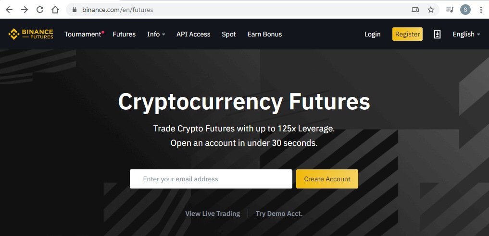
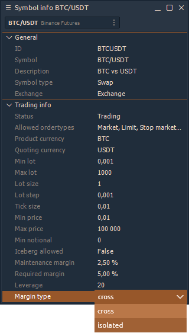

# Connection to Binance Futures

To start trading on Binance Futures through Quantower platform, you need to open an account and create an **API Key** and **Secret Key**. In this guide we will show you step-by-step how to set up the connection, change margin type and leverage size.

* \*\*\*\*[**How to connect to Binance Futures in Quantower platform**](connection-to-binance-futures.md#how-to-connect-to-binance-futures-in-quantower-platform)\*\*\*\*
* \*\*\*\*[**How to change Leverage and Margin Type**](connection-to-binance-futures.md#how-to-change-leverage-and-margin-type)\*\*\*\*

## How to create a new Binance Futures account

* Go to the ****[**Binance Futures**](https://www.binance.com/en/futures) official website to open a _**live account**_.  If you want to create a _**demo account**_, you can open it on [**Testnet Binance Futures**](https://testnet.binancefuture.com/en/futures) website

* Fill in the account registration form with your enail and safe password. Click on Create account and you will receive a verification email shortly. Follow the instructions in the email to complete your registration.
* Once you are on the Binance Futures page, you should be able to see the first two characters of your email address associated with your account in the top right corner.

* Click on the logo of your account and in the _**Settings**_ section select _**API Management**_. Create a new API Key \(if you don't have it\) and save it.

## How to connect to Binance Futures in Quantower platform

* Launch Quantower platform and open [Connections Manager](connections-manager.md). Select Binance Futures in the list and select the type of connections — **INFO** or **TRADING** mode.

* For trading, please enter your **API Key** and **Secret Key**.

## How to change Leverage and Margin Type

* Binance Futures allows you to trade various instruments and manually change the leverage for each one. To change it, open the [**Symbol Info**](../informational-panels/symbol-info.md) panel and select the necessary symbol. At the bottom of this panel there is a **Leverage** field where you can change the value and apply it by clicking the **Enter** button.

Binance offers two types of margin for futures trading:

**Cross Margin Mode**: Share your margin balance across all open positions to avoid liquidation. In the event of liquidation you risk losing your full margin balance along with any remaining open positions. 

**Isolated Margin Mode**: Manage your risk on individual positions by restricting the amount of margin allocated to each. If the margin ratio of a position reached 100%, the position will be liquidated. Margin can be added or removed to positions using this mode.


For new accounts on which no trades were made, it is **not possible to change the leverage and margin type**. 

To enable these functions, you need to make at least 1 trade for current symbol. After that, please restart the platform and these features will be available.


