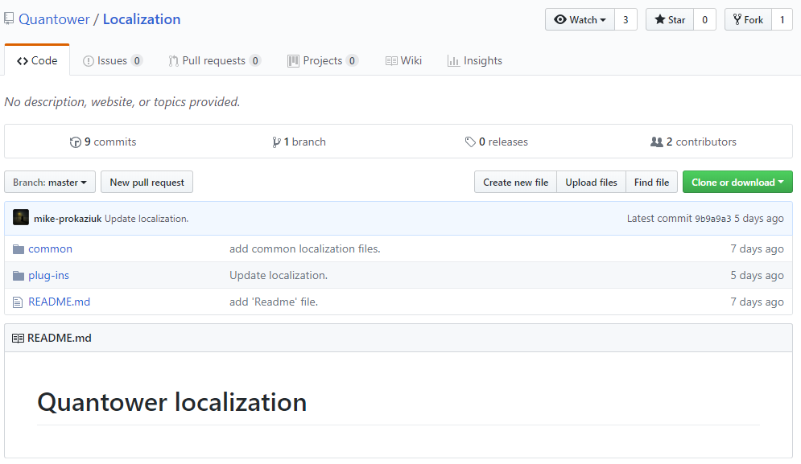
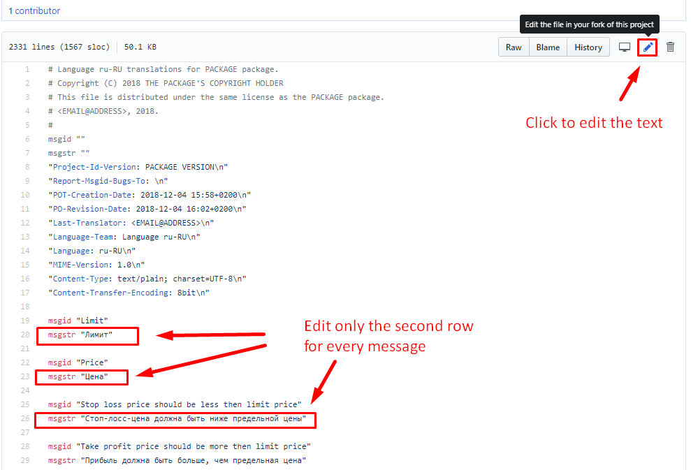
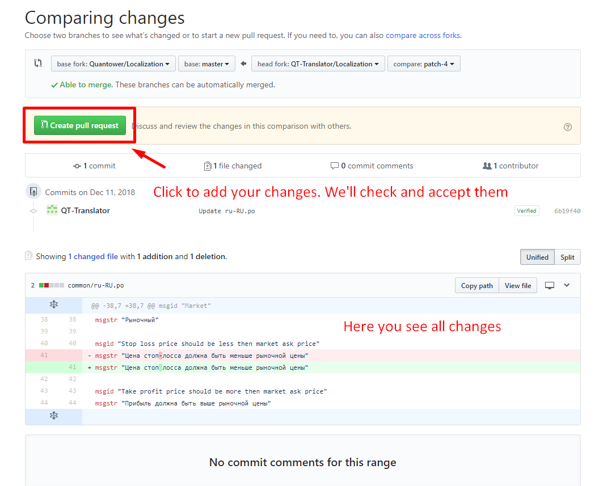

# Customization

### Language localization

Quantower offers users several languages, which greatly simplifies the process of working with the platform. In addition to English, there are 14 other languages available, which we are constantly updating and adding new ones.  
In case of errors or inaccuracies in translation, any user can make changes to the text. To do this, write to us in the support or change the text in the file, which is located on the Github repository. The next time you upgrade the platform, all your changes will be automatically applied.

### How to make changes to the localization file on Github

* Go to the [**Quantower/Localization**](https://github.com/Quantower/Localization) section on Github, where the translation files for each panel are located. Here is the link  [https://github.com/Quantower/Localization ](https://github.com/Quantower/Localization%20) 
* Register the account or log in to Github using your login and password. We can provide you with an account for making changes to localization files. To do this, write to us in support. 
* Localization files are stored in two folders:     **Common** — contains all common phrases for the whole terminal;     **Plug-ins** — includes folders with all the panels that contain translation files for specific panels. 

* Go to the Common folder and click on the language file you want to change. Click on the _**"Edit"**_ icon and change the required text only in the second line. The first line — **msgid** — is the key in the English version. The second line — **msgstr** — translation of the English key into the selected language.

* After making the changes, click on the **\[ Propose file change \]** button at the bottom of the page.

* You will see all the changes you have made, which you can check and edit if necessary. Click on **\[Create pull request \]** to send us a request to modify the text. After we accept the request, all changes made will appear in the next update of the platform.

If you have any additional questions, please write to us in support and we will help you.

