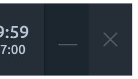
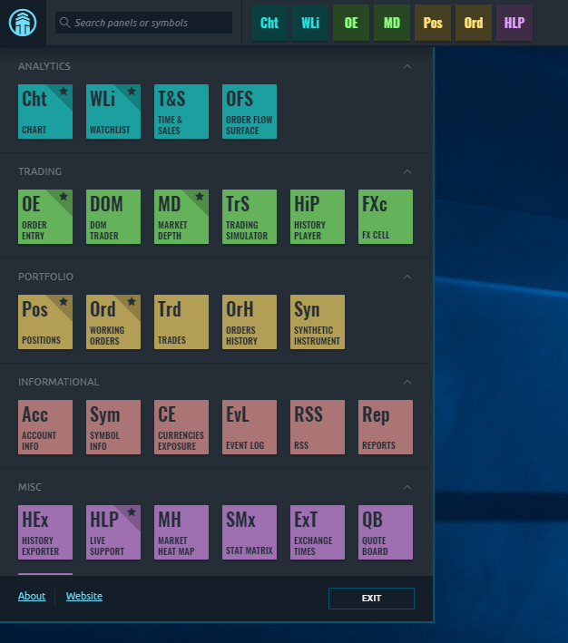
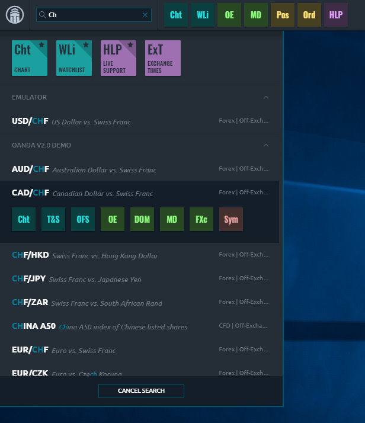
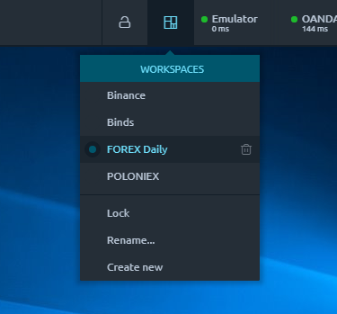
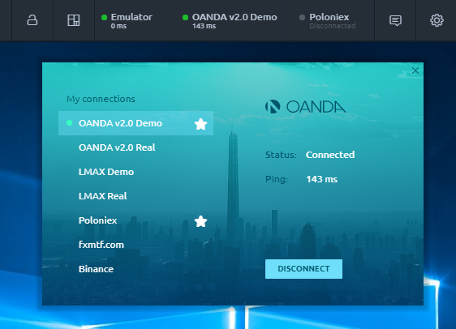
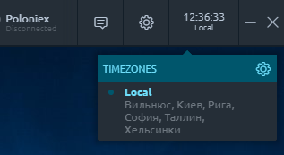

# Control center

## General

In our application, Control center — is the main starting point of all terminal, used as a launcher and informer simultaneously. The main functions of the Control center \(CC\) are:

* Launcher for panels
* Workspaces holder
* Connections monitor
* General settings access point

CC technically is a panel, but behaves something differently: it can be dragged among your screens \(if you have more than one\) and it will be always stuck at the top of the screen. It adapts own width up to the screen width and it participates in the workspace, meaning, that other panels can be stuck to it. 

Due to the fact that CC is the main controlling panel it has an ability to collapse all terminal’s interface by clicking the “_**Collapse**_” icon. This action makes all application panels to collapse to the taskbar and literally disappear from your screens; it affects all panels on all screens. If you press the CC icon on the taskbar after the collapse, you will get all of the interfaces appear again.

The “_**Close**_” icon just closes the terminal. You may set up “_not to ask to confirm the closing_” setting in the pop-up screen while the first closing.

## Sidebar

Control center is the place where you can find any panel that is available under your license \(and even more\). All of the panels are placed in so-called “Sidebar” screen — the panel, popping out once you click the Logo icon on CC. 

The Sidebar consists of panels icons, grouped by the functionality. Each group can be collapsed in order to make the panels list cleaner. From this place, you can open any panel by left-clicking on its icon. Each group has its color to help you determine the functional assignment of each panel.

### Footer

The footer of Sidebar contains several functions:

* “**About**” link: opens a screen with information about terminal \(core version, updates checker etc.\). If the system detects the new version of Quantower, the “NEW VERSION” button appears instead of this link;
* “**Website**” link: opens the Quantower website;
* “**Exit**” button: closes the application.


The list of links in footer can contain more or fewer items, depending on current application requirements.


## Smart search

The Smart search block of Control center allows finding the various elements of the whole application. It is connected with the Sidebar and uses it to display the search results.

Currently, the Smart search feature allows you to find the following elements:

* Panels \(by their names\);
* Trading symbols among all active connections \(by their names and descriptions\)

In case you find a panel, just click its icon to open it. 

If you were looking for a trading symbol, click on it to see the list of supported panels, that can be opened, predefined with this symbol.

To cancel the search results — click the “_**Cancel search**_” button at the Sidebar footer. This will get you back to the default panels list view.

## Favorite panels

You might already have seen the Star icon in the right top corners of some panels tiles in Sidebar. This is the “Favorite panels” functionality, allowing you to select the most usable panels and place their icons on the Favorites bar on Control center.

The way to use it very simple — hover over the right top corner of any panel tile in Sidebar and click the Star icon appeared. That is all: panel appears in Favorite panels bar in Control center. To remove from favorites just click the activated Star icon on Panel's tile or right-click on the icon in Favorites panel and select “_**Hide from toolbar**_”.

## Lock trading

If you would like to prevent the manual trading operations occur, you may use the “_**Lock trading**_” button on Control center. Once clicked it displays the confirmation message that trading being locked and all of the functions, related to opening or closing orders and positions will be disabled. Unlock trading can be done the vice-versa way.

This feature is useful in case you would like to only analyze the market or while editing your workspace \(mostly to avoid misclicks\).

## Workspaces manager

{% embed data="{\"url\":\"https://www.youtube.com/watch?v=EoM78qCdJRM\",\"type\":\"video\",\"title\":\"How to: Managing workspaces\",\"description\":\"The workspaces in Quantower are the highest level of trading environment organization, and they are not so difficult to manage. This video shows you how to create, rename and delete your Workspaces in several clicks.\",\"icon\":{\"type\":\"icon\",\"url\":\"https://www.youtube.com/yts/img/favicon\_144-vfliLAfaB.png\",\"width\":144,\"height\":144,\"aspectRatio\":1},\"thumbnail\":{\"type\":\"thumbnail\",\"url\":\"https://i.ytimg.com/vi/EoM78qCdJRM/maxresdefault.jpg\",\"width\":1280,\"height\":720,\"aspectRatio\":0.5625},\"embed\":{\"type\":\"player\",\"url\":\"https://www.youtube.com/embed/EoM78qCdJRM?rel=0&showinfo=0\",\"html\":\"
<iframe src=\\\"https://www.youtube.com/embed/EoM78qCdJRM?rel=0&amp;showinfo=0\\\" style=\\\"border: 0; top: 0; left: 0; width: 100%; height: 100%; position: absolute;\\\" allowfullscreen scrolling=\\\"no\\\"></iframe>
\",\"aspectRatio\":1.7778}}" %}

One of the most vital parts of the Control center is the Workspaces manager. It allows you to see, create, edit and delete your working environments as well as lock their modification. It is represented with the special icon, that opens the list of available Workspaces once being clicked.

The currently active workspace is marked with the color and has a blue dot on the left side of its name. You can switch the current workspace by left-clicking any of available item from the list. The bottom part of the list \(after separator\) consists of actions, referred to the currently active workspace and allows to:

* **Lock**: disables an ability to add, remove, move or resize any panel in current workspace;
* **Rename...** : invokes a pop-up screen where you can set up a new name for the current workspace;
* **Create new**: opens a pop-up screen with the new workspace creation form.

When creating the new workspace, you have an ability to specify its future name and select whether it should be Blank, once created, or should contain some predefined panels set. 


The list of Workspace templates will be constantly growing. 


You can also Remove any of Workspaces by clicking the “_**Trash**_” icon on the right side from Workspace name \(icon appears while hovering the name\).

## Favorite connections

In order to use our terminal, you need to have at least one active connection. The list of active connections can be seen on Control center in Favorite connections block. By default, you will see several items here, each representing one of the available connections. The [Connection manager](connections-manager.md) screen will be opened by clicking any of items in Favorite connections block. 

In order to show some connection on this bar, you need to click a “_**Star**_” icon at the right side of connection name in Connections manager panel. Click once more, and the connection will be removed from Favorites bar.

Being added to Favorites bar, each connection will be displayed as a tile, containing some vital info:

* **Connection name**
* **Status text** \(can be a status message or Ping time in ms when the connection is active\)
* **Status Dot**, a visual representation of connection status. Can be grey \(disconnected\), yellow \(connecting\), green \(active\). If connected, the Dot blinks periodically.

You can Remove connection from Favorites by right-clicking on it and selecting “_**Hide from toolbar**_” item. Here you can also ask to connect or disconnect.

## Notifications center

The most actions during the platform use generate various notifications. There can be system notification \(some connection problems or errors\) and Deal tickets. The Deal tickets — are the notifications about the trading operations. Each time you create an order or opening a new position — we will create a deal ticket for this. 

While some trading actions may be done in one click at the first sight, they usually consist of several related operations, each of them will be displayed via the Deal tickets. That is why you can see much more items in Notifications center than you did actions. 

The Notifications center — is the place where all notifications are stored in one list. You can open that list by clicking the Notifications icon in Control center. 

When you have a set of new notifications, the small number will appear in the left top corner of Notification center icon. It displays how many unread notifications you have. Once you open the list — it understands that you have read them and the number will disappear. 

You will see all notifications just from the platform start. You may also clear this list by clicking the “_**Clear all**_” link. This action will hide all of the currently seen notifications from this list \(but they will be still available in Event Log panel\).

By clicking one of the notifications you will see the window with the detailed info.

## General settings

The “_**Gear**_” icon opens a general settings screen, where you can setup the most common parameters of our terminal. More details about the Settings screen is available in the corresponding section of this documentation.

## Time & Time zones

The Time bar is also displayed on the Control center toolbar showing you time in selected timezone. By default, your local timezone is used. You can change the time zones list by clicking the "_**Gear**_" icon and then select the required ones in [**General settings screen**](general-settings.md). You may also select several time zones and they will appear as a list in a drop-down panel, allowing you to switch among them quickly.

