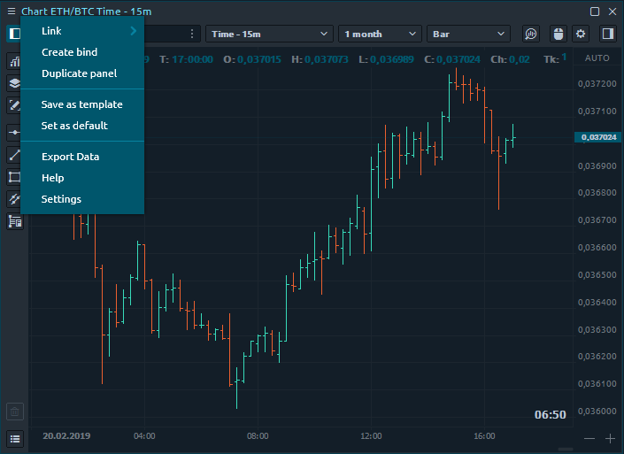
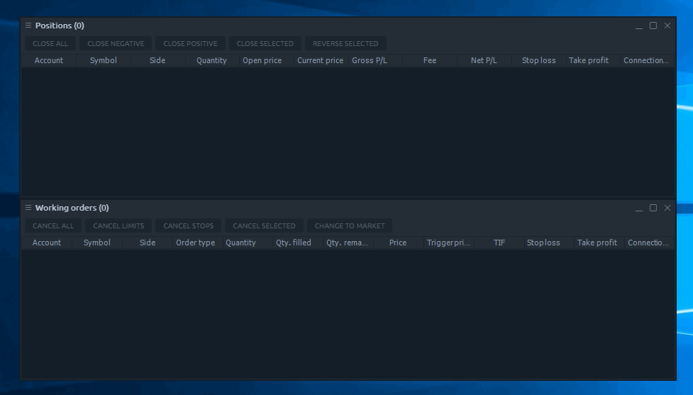

# Workspaces, Binds, Groups

We have divided the Workspaces organisation hierarchy into four basic layers \(in terms of its scales\):

* \*\*\*\*[**Standalone panels**
  ](workspaces-binds-groups.md#panels)\*\*\*\*
* \*\*\*\*[**Groups**
  ](workspaces-binds-groups.md#groups)\*\*\*\*
* \*\*\*\*[**Binds**](workspaces-binds-groups.md#binds)
  ****
* \*\*\*\*[**Workspaces**](workspaces-binds-groups.md#workspaces)\*\*\*\*

Each layer plays its role in process of Workspace contents organization and we sure that once you get used to our process, you will find it convenient, flexible and able to accomplish any of your ideas.

### Panels

Standalone panels are the minor elements of any Workspace and they behave just like any usual PC window:

* can be resized and positioned to any place on your screen;
* can stick to each other within their borders when they close enough;
* can stick its size to repeat the dimensions of other panels, while resizing;
* can be collapsed to the OS taskbar as usual windows

### Panel's context menu

Each panel has its own **context menu**, situated on the left upper corner, right before the Panel’s title.

This menu usually consists of following functions:

* **Link**. Allows linking several panels by common symbol using the Color definition. Just select one link color in two panels and they will have a synchronized symbol parameter. Once linkage is applied, the panel’s title will be colored to the respective color.
* **Create bind**. Combining several panels in Super-panel. More in corresponding section below.
* **Duplicate panel**. Just creates one more totally similar panel.
* \*\*\*\*[**Save as template**](https://help.quantower.com/getting-started/templates). Customize the panel, combine in a group or Bind and save as template.
* \*\*\*\*[**Save as default**](https://help.quantower.com/getting-started/set-as-default)**.** Each panel type has its own settings by Default. You can tune them whatever you want and even make your personal defaults. Just select “_**Set as Default**_” option, and Quantower will store your current panel’s settings and will apply them for each newly opened panel of this type.
* **Help**. If you have questions about working with the panel or specific functionality, click on this link and you will immediately redirect to the documentation for this panel.
* **Settings**. Personal settings per each panel. Opens a Settings screen where you can tune your panel as you like and then, in case of need, save these settings as Defaults.



### Groups

The simplest level of combining several panels together is a group. This layer allows to arrange several panels as nested tabs and then move the created group as one panel. 

To group two panels just click and drag one Panel’s header over another. To ungroup panels just drag an active Panel’s tab out of group tabs bar.

Panels can also be reordered within group tabs as well as closed being grouped. Each newly created group has a default name “**Group**” that can be easily changed via panel’s context menu.


Grouping is very useful for saving space and putting together several common panels.


### Binds

The most innovative and, we are sure, a useful layer of panels organization — is Binds \(binding\). It was developed to allow a user to create its own “Super-panels” — the sets of basic panels that should be stuck together. Generally, Binds allows to create any combination of panels in any required way; the only limit is your fantasy.

Creation of Binds is an easy process: 

1. place several panels on your workspace close to each other;
2. focus on one of the panels;
3. press “_**Ctrl + ~**_” hotkey or select “_**Create bind**_” from panel’s context menu \(this turns the Bind mode on\);
4. click on the panels, that you want to bind together or just hold the left mouse button and drag \("draw"\) over that panels to make them selected in one area;
5. press “_**CREATE BIND**_” button in the right-bottom corner of the Bind area \(or hit “Enter” button on your keyboard\); 
6. that is all — now you have your own Super-panel.


Keep in mind: intersected panels can’t be binded.


Each Bind acts as a single panel so when you resize it, it proportionally resizes all its containing panels. You may also drag the inner-separators to modify the dimensions between panels. Once you put some separators in one line, they will stick and resize as one.

In order to edit the contents of the Bind, you should unbind it using its context menu option “Unbind”.


Please notice that not all elements of Quantower can be binded. This feature doesn’t allow to combine screens \(like Connections manager, settings\) and some non-standard panels: Order entry, FXCell. This restriction was made because of impossibility to resize the Screens while binds should contain only the resizable items.


### Workspaces

The highest level of trading area organization — is a Workspace. This is the most general grouping layer that you may even don’t need most of the time. Binds and single panels are already enough for most use cases, but if you prefer to have a logically-separated environment \(like “Trading - Analysis - News” or “Grains - Bonds - Metals” etc.\) — Workspaces are your solution. 

Because of its nature \(the global grouping tool\), Workspaces manager is situated on Control center panel and can be invoked by clicking the corresponding button. [More about creating, managing and switching the workspaces](control-center.md#workspaces-manager) can be found in Control center section.

As a top-level grouping layer, Workspaces store all their contents in special local files. These files can be found in _**Quantower -&gt; Settings -&gt; Workspaces**_ folder. Each file represents some workspace; both have the similar names. Technically, the workspace file is an XML-document containing all of the settings of all panels that are in the workspace. 




Quantower auto-saves each workspace into its local file every 5 mins, in order to keep them safe.


