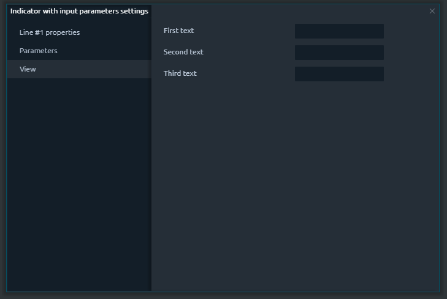

# Input Parameters

## General

In the previous topic, we showed you [how to create a basic indicator](simple-indicator.md) using Visual Studio with Quantower Algo extension and use it on the chart in the trading platform. We created a Simple Moving Average indicator with hardcoded parameters. But what if we need to change these parameters? For example, we want to use Open prices instead of Close or use another Period. It is not very convenient to recompile your indicator each time and we provide you a possibility of easy tuning your scripts via so-called Input Parameters.

## **What is input parameter?** 

After adding an indicator on the chart you can find Setting menu item on it displaying "Settings" window. Indicators usually have some common settings, for customizing lines, and specific settings, that related to their algorithm or calculations.

You can create any amount of input parameters, needed in your scripts. They can be used both for indicators and strategies.

From a technical point of view, Input Parameter is a usual variable marked with a special attribute. At the moment we support main basic types: string, number, date time, account, symbol, a list of options and others.

We will show in details how to declare each type of input parameters and how to customize them.

## **Types of Input Parameters**

### **Text**

Sometimes you may need a user to provide some text information, for example for displaying on the chart. For this, you need to declare a string variable and mark it as **InputAttribute**. You need to specify the name of an input parameter, which will be displayed in Settings screen:

```csharp
[InputParameter("Text")]
public string text;
```

If you call settings screen you will see text box, which you can use to enter a value. That's all - your first input parameter is ready:


If you have a few input parameters and want to arrange them in an appropriate order, you can apply SortIndex parameter for each InputParameter:

```csharp
[InputParameter("First text", 1)]
public string firstText;

[InputParameter("Second text", 2)]
public string secondText;

[InputParameter("Third text", 3)]
public string thirdText;
```

  
As you can see, parameters displayed in specified order:



### **Boolean**

In case you need a simple switcher, for example, to enable an option, you can use bool variable with an InputParameter attribute:

```csharp
[InputParameter("Boolean")]
public bool boolean;
```

### **Number**

One of the most important types of input parameters is numbers. Input parameters can be applied to **int**, **double**, **long** and **decimal** variables:

```csharp
[InputParameter("Integer")]
public int intNumber;
```

You can specify additional parameters - minimum/maximum value, increment, and decimal places.

```csharp
[InputParameter("Double", 0, 0.00001, 10, 0.00001, 5)]
public double doubleNumber;
```

### **Symbol**

Sometimes you may need possibility so select symbol, for example in case of calculation of correlation between symbol from the chart and another symbol. And again - all you need just declare variable and mark in with **InputParameter** attribute:

```csharp
[InputParameter("Symbol")]
public Symbol symbol;
```

### **Account**

If your script is executing some trading operation you need to provide an account setting. Use a variable of **Account** type for this:

```csharp
[InputParameter("Account")]
public Account account;
```

### **DateTime**

Usually, DateTime settings are using to specify some range of history, for example, left and right border of downloaded history:

```csharp
[InputParameter("Date")]
public DateTime dateTime;
```

### **Color**

Color Input Parameters store color value in an RGB format:

```csharp
[InputParameter("Color")]
public Color color;
```

### **List with options**

To do...

## Conclusion

To summarize all said above, we gathered all types of Input Parameters to show you how they can look in settings screen:


These basic types of Input parameters are enough to create complex indicators and strategies with a wide list of settings. Despite this, we are constantly adding new Input Parameter types. Feel free to contact us and propose your variants — we are open to our users' feedback.

