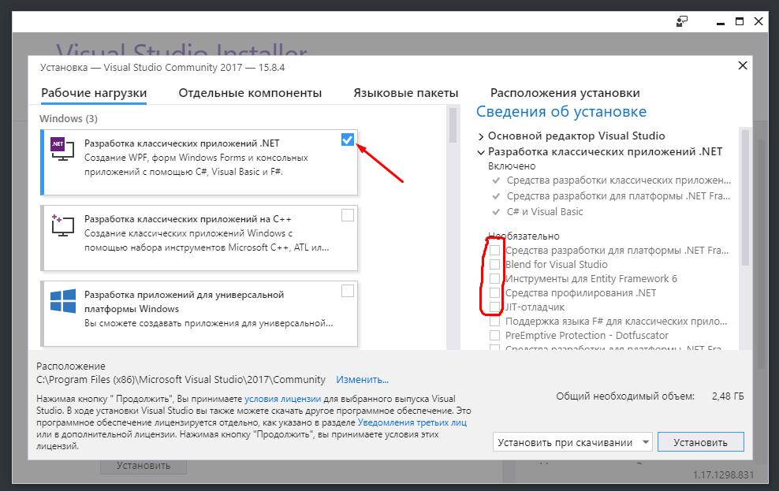

# Installing Visual Studio

In this topic we will show how to install Visual Studio and Quantower Algo extension, which allows you to create your own indicators and strategies. Visual Studio - is an integrated development environment \(IDE\) from Microsoft, which includes a code editor with IntelliSense, debugger, supporting for source control systems and many other professional features. The currently supported Visual Studio version is 2017. We recommend you to use most basic version of Visual Studio, the Community edition, which is available free of charge.

You can download Visual Studio from [official web site](https://visualstudio.microsoft.com/thank-you-downloading-visual-studio/?sku=Community&rel=15). It requires about 10 minutes to install and 2.5 Gb of free space on your hard drive.

Download web installer and run it. After initialization you will be prompted to select required components. For using with Quantower Algo extension we need only "NET desktop developement" workload. You can uncheck optional components also, to reduce installation size:

Continue installation and in a few minutes, after downloading and applying required packages, Visual Studio will start automatically:

Now we need to install Quantower Algo extension from Visual Studio Marketplace. Use "Tools -&gt; Extension  and Updates..." main menu item to open Extensions Manager. Type Quantower into search box in Online tab and will find required extension:

Click for downloading. Visual Studio will ask you for restarting to finish extension installation process.

To check whether Quantower Algo is installed successfully click "File-&gt;New-&gt;Project" menu item and you will see special project types: Indicator and Strategy:

Now everything is ready to create your first indicator.

