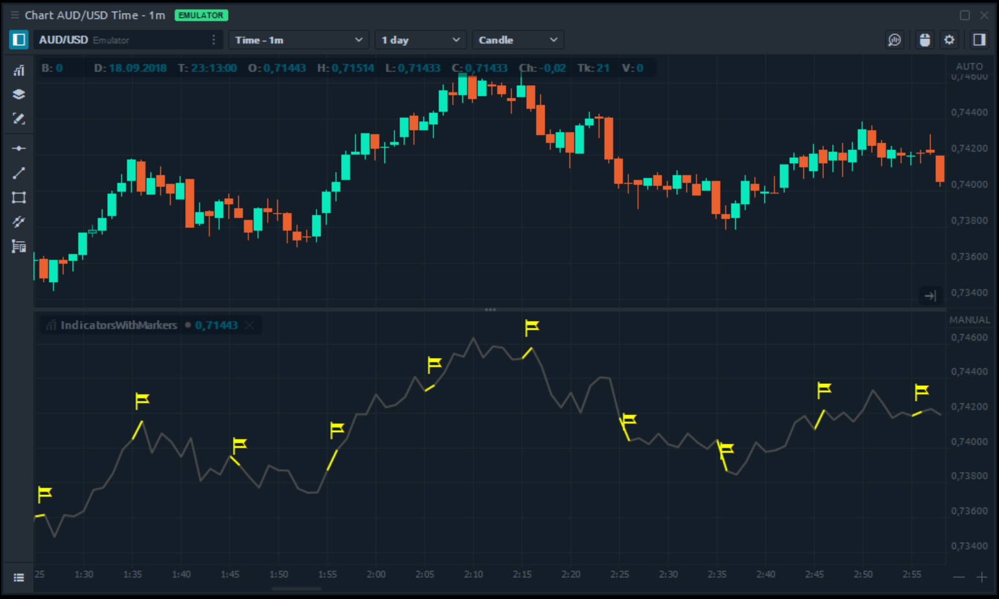
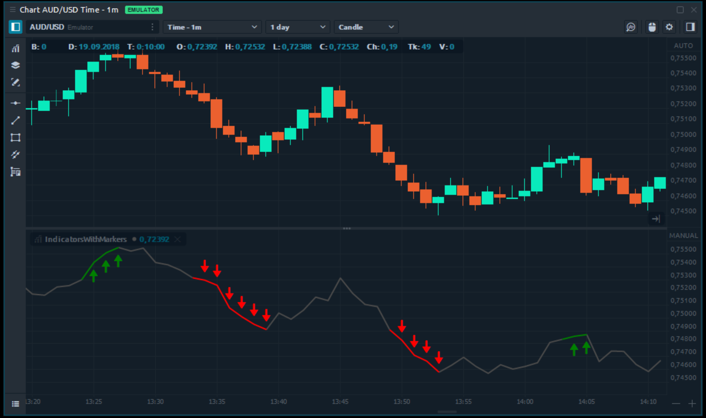

# Using markers with indicators

During writing indicators, you may need to mark some specific point or set of points of indicator's line. For example you want to mark the place where two lines are crossing or place where your algorithm find a some bar pattern. Yes, you can use GDI+ drawing for this, we've shown an example in [our previous topic](https://help.quantower.com/quantower-algo/indicator-with-custom-painting-gdi), but Quantower API provides more simple and elegant way.

Each indicator line contain method **SetMarker**, which allow you to assign some special style for particular element in your indicator's line buffer. The most simple way is marking it via specified color. This is an example:

```csharp
// Mark current bar with Yellow color
LinesSeries[0].SetMarker(0, Color.Yellow)
```

Just for example we color in yellow each tenth bar:


Another way of marking is using icons. You can specify type of icon, it's position and color. You can use the same overridden method **SetMarker**:

```csharp
// Mark current bar with yellow color and flag icon in the top position
LinesSeries[0].SetMarker(0, new IndicatorLineMarker(Color.Yellow, IndicatorLineMarkerIconType.Flag));
```

And a results on the chart:



You can specify color, upper icon and bottom icon. Lets create a little more practical indicator. For example - we will mark with green up arrow places where we have more then 5 growing candles and red bottom arrow if 5 down. This is source code:

```csharp
/// <summary>
/// Calculation entry point. This function is called when a price data updates. 
/// </summary>
protected override void OnUpdate(UpdateArgs args)
{
    // Use open price as a source for our indicator
    SetValue(Open());
    
    // We are looking for 5 bars with same direction
    int amountofBars = 5;
            
    // Not enough data yet - skip calculations
    if (Count < amountofBars)
        return;

    // Going though last 5 bars
    int trendValue = 0;
    for (int i = 0; i < amountofBars; i++)
    {
        // Is it growing bar?
        if (Close(i) > Open(i))
            trendValue += 1;
                
        // Is it falling bars?
        else if (Open(i) > Close(i))
            trendValue += -1;
    }

    // If all 5 bars were growing - mark with green up arrow on bottom
    if (trendValue == amountofBars)
        LinesSeries[0].SetMarker(0, new IndicatorLineMarker(Color.Green, bottomIcon: IndicatorLineMarkerIconType.UpArrow));

    // If all 5 bars were falling - mark with red down arrow on top
    else if (trendValue == -amountofBars)
        LinesSeries[0].SetMarker(0, new IndicatorLineMarker(Color.Red, upperIcon: IndicatorLineMarkerIconType.DownArrow));
}
```

And its visualization:



Using **SetMarker** functions you can simply mark important moments on your indicator. We are going to extend markers possibilities: add more new icons, add text and custom painting. And you can always propose us your own ideas.

