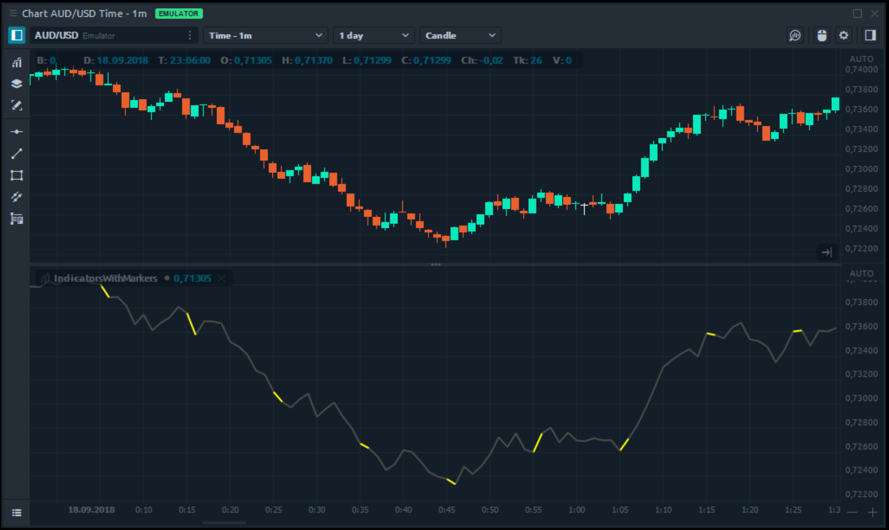

# Using markers with indicators

During indicators development, you may need to mark some specific point or set of points on indicator's line. For example, you want to mark the place, where two lines are crossing or place, where your algorithm find some bar pattern. Yes, you can use GDI+ drawings and **OnPaintChart** method, as we've shown in our previous topic, but Quantower API provides a more simple way to accomplish this.

Each indicator line contains method **SetMarker**, which allows you to assign some special style for the particular element in your indicator's line buffer. The most simple way is marking it via a specified color. This is an example of usage:

```csharp
// Mark the current bar of first indicator line with Yellow color
LinesSeries[0].SetMarker(0, Color.Yellow)
```

We colored in yellow each tenth bar:



Another way of marking is using icons. You can specify a type of icon, it's position and color. You can use the same overridden method **SetMarker**:

```csharp
// Mark current bar with yellow color and flag icon in the top position
LinesSeries[0].SetMarker(0, new IndicatorLineMarker(Color.Yellow, IndicatorLineMarkerIconType.Flag));
```

Result is displayed on the chart:


Let's create a little more useful indicator. For example - we will mark with a green up arrow, places where we have more than 5 growing candles in a row and mark with a red bottom arrow, in the case of 5 falling bars. This is source code implementing this logic:

```csharp
/// <summary>
/// Calculation entry point. This function is called when a price data updates. 
/// </summary>
protected override void OnUpdate(UpdateArgs args)
{
    // Use open price as a source for our indicator
    SetValue(Open());
    
    // We are looking for 5 bars with same direction
    int amountofBars = 5;
            
    // Not enough data yet - skip calculations
    if (Count < amountofBars)
        return;

    // Going though last 5 bars
    int trendValue = 0;
    for (int i = 0; i < amountofBars; i++)
    {
        // Is it growing bar?
        if (Close(i) > Open(i))
            trendValue += 1;
                
        // Is it falling bars?
        else if (Open(i) > Close(i))
            trendValue += -1;
    }

    // If all 5 bars were growing - mark with green up arrow on bottom
    if (trendValue == amountofBars)
        LinesSeries[0].SetMarker(0, new IndicatorLineMarker(Color.Green, bottomIcon: IndicatorLineMarkerIconType.UpArrow));

    // If all 5 bars were falling - mark with red down arrow on top
    else if (trendValue == -amountofBars)
        LinesSeries[0].SetMarker(0, new IndicatorLineMarker(Color.Red, upperIcon: IndicatorLineMarkerIconType.DownArrow));
}
```

And its visualization:


Using **SetMarker** functions you can simply mark important moments on your indicator. We are going to extend markers possibilities: add more new icons, add text and custom painting. And remember - you can always propose us your own ideas.

