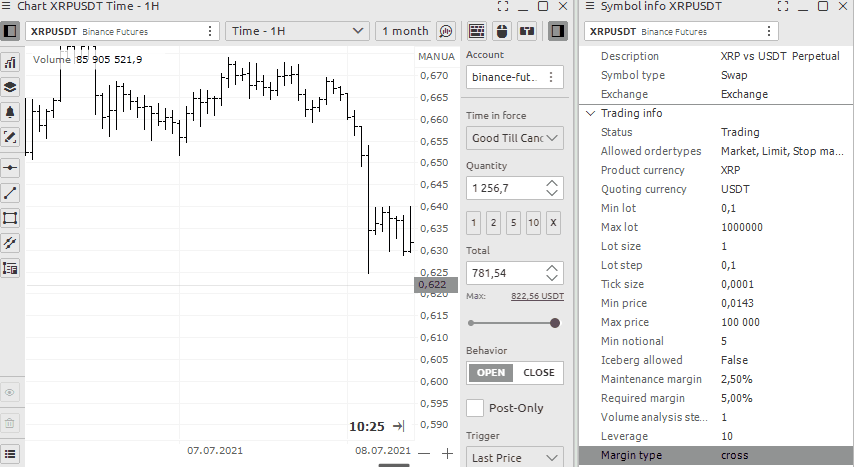

# Chart Trading

Entry of orders on the Quantower platform on the exchanges can be done in different ways, depending on the chosen trading style: 

* From the quick trading panel 
* How to open  quick trade toolbar
* How to set up Account in quick trade toolbar
* How to set volume
* Mouse trading
* From the chart trading mode with the mouse, visual trading.
* Quick order placement through the chart area with a mouse.
* *  By setting up and trading from the hotkeys.

## Trading with the quick trade toolbar

Trading with the quick trade toolbar The quick trade toolbar appears by clicking on the button marked on the picture. If you don't have it you should enable it from the chart settings. See here how it is [done](../analytics-panels/chart/chart-settings.md).

### **How to set quantity**

**Quantity** is the number of lots for a trade. Here you can set your custom values according to your risk and money management. See chart settings for how to do this.


You can also set standard lots for trading and switch between them with hot keys - \(1-9\) on your keyboard


**Hidden menu in quick order panel** 

By right-clicking you can save the default order entry settings for each symbol

There are two ways to enter the size of a position 

* Entering an order in lots of a traded symbol or coin. 
* Entering the amount of money planned to purchase that asset.


It is important to remember that if you use margin trading, the result is counted taking into account the leverage.


 For example, at the moment you have $82 on your account and 10 leverage is set. It means that you have $820 available balance for trade. This is what you can see in the example.

### How to set up Profit and Stop orders

Then you can set **automatic stop loss and profit** in pips. It's very convenient to set the lot size and protect it. Specify your values in the appropriate fields.


Some brokers such as Binance do not allow stop orders for limit orders. \(Until the position is NOT open\) In this case, use limit orders of the opposite direction


* Use the Qquick Ttrade toolbar 
* Set your values for stop loss or profit. You can also use any one parameter only. 
* Use the button to activate the trade with the mouse to set a limit order


If you execute an order at market, the specified stop parameters will retain their values and will be set immediately.


### How to set up  multiple Profit and Stop orders for one position

* To set multiple stop orders for a single position, do the following Switch the bracket \(stop\) settings to multi mode 
* Enter data for setting the first limit orders and how many lots or coins should be closed 
* For the next stops, enter similar data on the next line.
*  You can set orders in multiples of your total volume.

Next comes a block of buttons for **quickly placing an orde**r into the betting slots at the appropriate price.

Next comes a large block of functions for managing the current position. You can delete or limit orders or stops. You can also reverse your position with one button or set it to no loss. These are very functional buttons, do not miss them.

