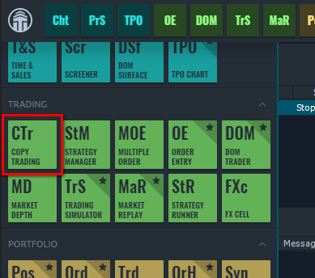
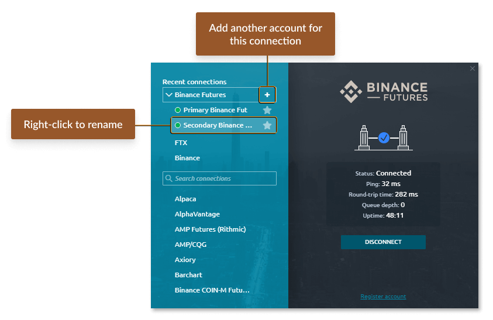
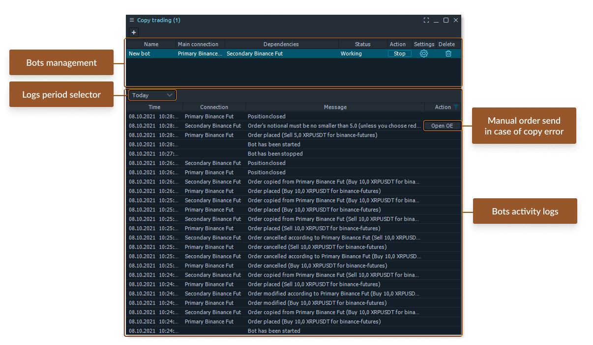
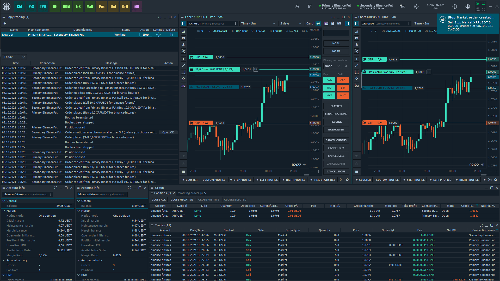

# Copy Trading

One of the frequent questions from our community is: how to Copy trading between multiple accounts? Such functionality can be very useful for proprietary trading companies and managers with multiple accounts who use Quantower as their trading tool.

## **Introduction**

The panel performs trading operations thus can be found in the "Trading" group of the Quantower main menu.

Copy trading panel allows you to fully duplicate trading activity between multiple accounts of the same connection. Unlike the “Multiple order” panel, this panel will automatically copy all Parent's account transactions into the specified Child account(s) once you have created and launched a special algorithm (Bot).


Before you start creating your first Copy-bot, please notice the following information:

\- Copy-trading can work only if the Quantower terminal is launched.

\- If the dependent connections (parent & child) are NOT ACTIVE, the Bot will copy orders for active connections only and ignore disconnected.

\- If Parent order parameters are different than a Child account can submit, you will get a notification about this and the possibility to manually copy the order by clicking the **Open OE button** next to this message in the logs section. The most common cause of such behavior is when the Child account has insufficient funds to copy the parent's order quantity.

\-The Copy trading panel currently supports the following connections only: FTX, Binance, Binance Futures, Bitfinex, Rithmic, Bybit, BitMEX, and Interactive Brokers




## Create a Copy-bot

Once you open a Copy trading panel, you will find the Bots management screen, divided into “Bots list” and “Logs”. Let’s create a new copy trading bot. To do this, click on the Plus button on the panel’s toolbar, and you will see the “New copy trading bot” screen appear.

Here you should name your bot and specify Parent connection (account) to set up where to copy trades from. Now we should add dependent connections by pressing the Plus button next to the “Child connections” label. Each new item line in the following table represents a Child connection that will copy all trading activities from the Parent.&#x20;

### Add multi accounts for the same connect&#xD;

Now we should specify the dependent connection and account. To add another account for the same connection in Quantower, you should go to Connections manager, duplicate the required connection, rename it optionally, and log in with another account credentials. You may repeat this action for as many accounts as you need. Later you will see all these accounts in Child connections settings.

### Copy-trading mods&#xD;

The quantity copy mode option tells the bot how to calculate the quantity for copied order relative to the Parent order. There are two options: Percentage and Multiplier.

In a **Percentage mode**, the bot will calculate the quantity relative to the Parent account balance in percent and then apply this percentage to the Child account balance to set the Copy order quantity.


**Percentage Example:** Parent account has a balance of $1000. The Child account has a balance of $2000. When you place an order on the parent account equal to $100 (10% of the total balance), an order will be placed automatically on the child account for 10% of its total balance, or 200$.



In a **Multiplier mode**, the bot will take a quantity from the Parent order and multiply it with the Multiplier coefficient, thus getting a quantity value for a Child copy order.


**Multiplier Example:** The parent account has an order of $100, and the Bot is set up with Multiplier Coefficient (C)=0.5. Once you place the order on the parental account, the order will be copied to the child account considering C=0.5, i.e. $100 \* 0.5 = $50


Once we set up all of the Bot settings, click the Save button. Now we see that the new Copy trading bot appeared in the Bots list section.

Copy-Bots management

Once created, any Bot is stopped and not monitoring Parent’s trading activities. To activate it, click the Start button. Now it is Working and ready to copy your orders to Child accounts.

Bot management table contains the following information and controls:

* **Bot name.** Each bot can be given its unique name;
* **Parent account.** Account to copy trades from;
* **Child account.** Account to copy trades to;
* **Status.** Bot's current status. Can be "Working" or "Stopped";
* **Action.** Button to start/stop bots;
* **Settings.** This "gear" icon opens settings of the selected trading bot;
* **Delete.** Removes the trading bot.

Visual control

You can visually observe the complete synchronization of trades by opening two charts at the same time. Just after you send an order, the Bot will copy it to a Child account. If you modify your order — the Child account order will be modified also. Canceled orders will be canceled for the dependent account also. By the way, Stop Loss and Take profit orders for our position are also successfully mirroring to the dependent account.

All actions of activated Bots will be shown in a Logs list at the panel’s bottom, including information about "start" & "stop" time, and all of the copy-trading activities. You can even change the logs period on the toolbar above the Logs table.
