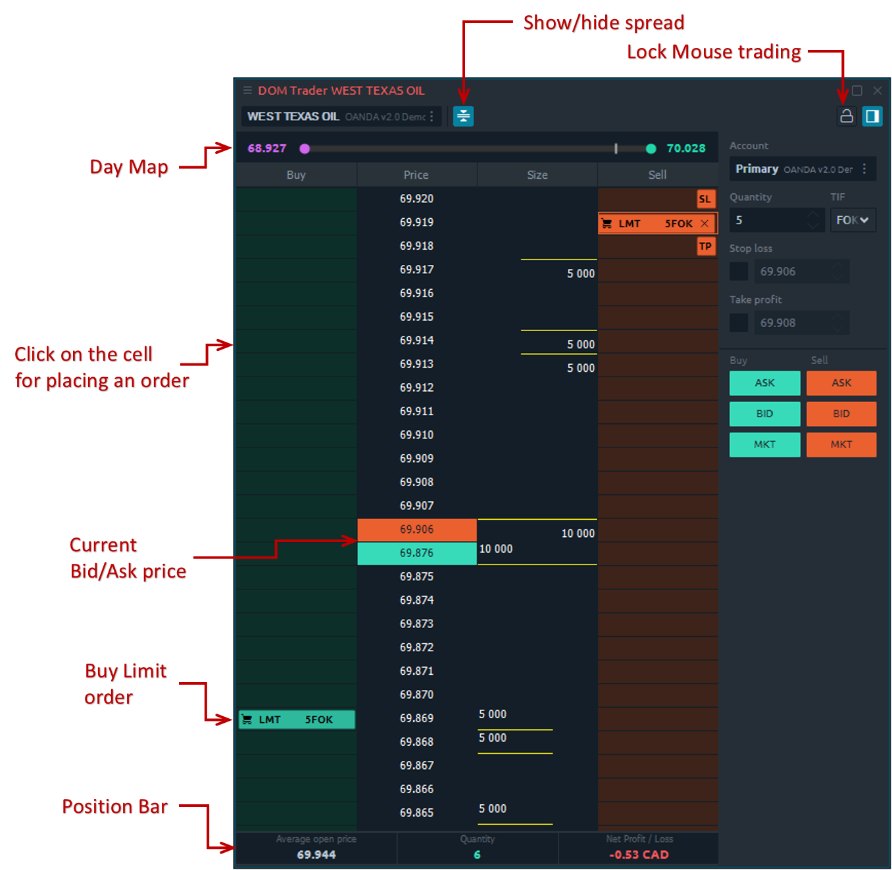
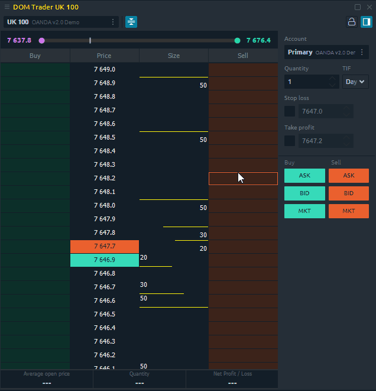
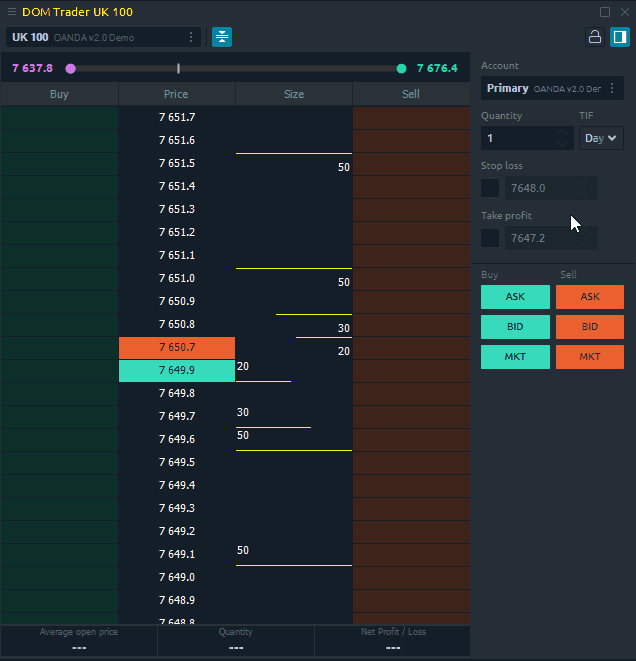
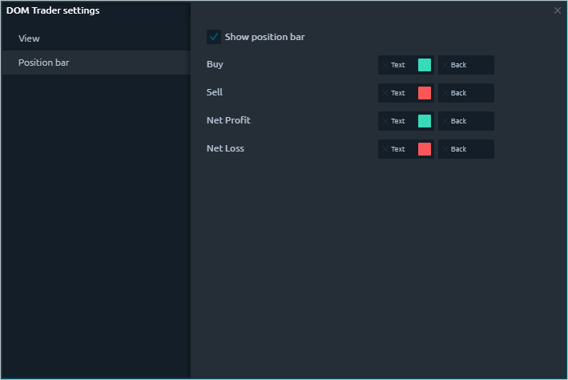

# DOM Trader

### General info

The Depth of Market or DOM panel shows the number of buy and sell orders placed at various price levels around the current price for a particular instrument \(most often for futures\). The more the number of orders is at a certain price level, the higher the interest in this level. The trading functionality of the panel allows you to quickly and efficiently place the required number of orders at the selected price, and also drag-and-drop, change or cancel them.

### Trading with DOM Trader

DOM Trader allows to send trading orders in two ways  — **Mouse Trading mode** and **Order Entry**

To place an order via Mouse Trading mode:

* Select an account and order restriction \(TIF\) in the order entry;
* Enter an order quantity;
* Left-click at a specific prices in the left column will place a Buy Limit order \(below the current market price\);
* Left-click at a specific prices in the right column will place a Sell Limit order \(above the current market price\). If you place the order below the current price it will be executed by market price;
* To place a Stop order is necessary to press and hold down the _**Shift**_ key and click at a required price.

To place an order via Order Entry:

* Select an account and order restriction \(TIF\) in the order entry;
* Enter an order quantity;
* Click on the Bid, Ask or Market button to place your order;
* Confirm your placement by first checking all the parameters.

### DOM Trader settings

Additional settings of the DOM Trader allow you to customize general view for convenient display of data and the panel in general.

#### View settings

* **Show high/low.** Display High / Low data on the price ladder;
* **Show last trade indicator.** Graphic element in the form of a triangle on the price ladder, which shows at what price was the last trade;
* **Antagonistic size bars.** A mode that allows you to place Ask and Bid volume on one or different sides of the Size column;
* **Full-size cells.** Color scheme for Size column;
* **Show order entry.** This option shows/hides an Order Entry on the panel for quick order placement;
* **Collapse spread.** Hide or show the spread between the current Bid / Ask prices on the price ladder;
* **Show day map.** Display the upper horizontal scale, which shows the current price position relative to the High and Low of the day;
* **Show toolbar.**  This option shows/hides the top toolbar with the trading symbol and expands the "useful" area of the panel. It is recommended to use this option with the symbol link.
* **Show Level 1 bar.** Shows/hides the header pane, which contains Level 1 market data for the selected instrument.

#### Position Bar settings

At the bottom of the DOM Trader is the Position Bar, which displays a brief info about an open position on the current trading instrument  — the number of contracts, the average open price, current profit and loss.

